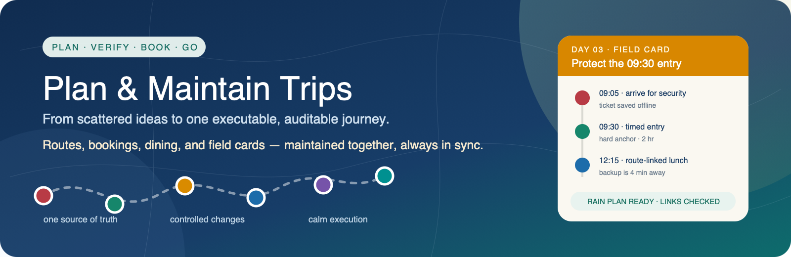
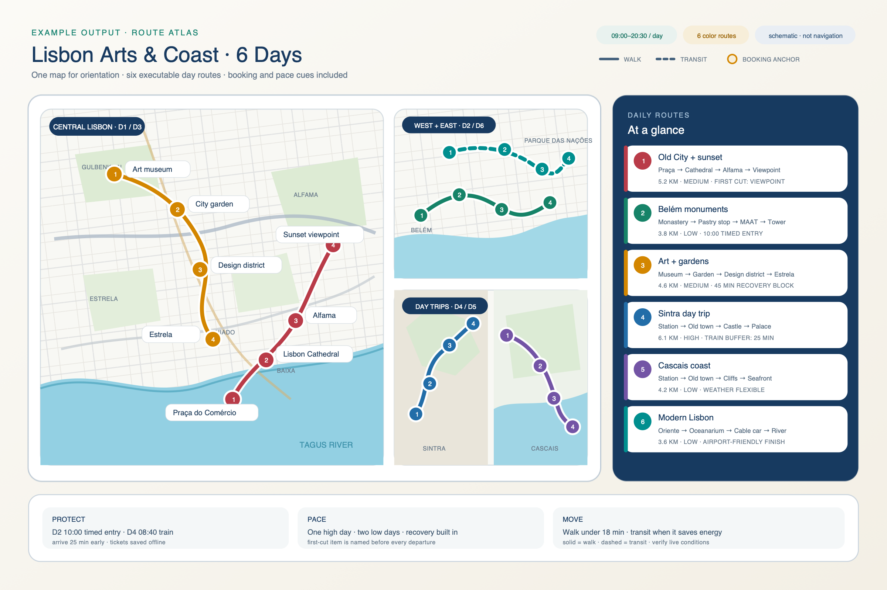
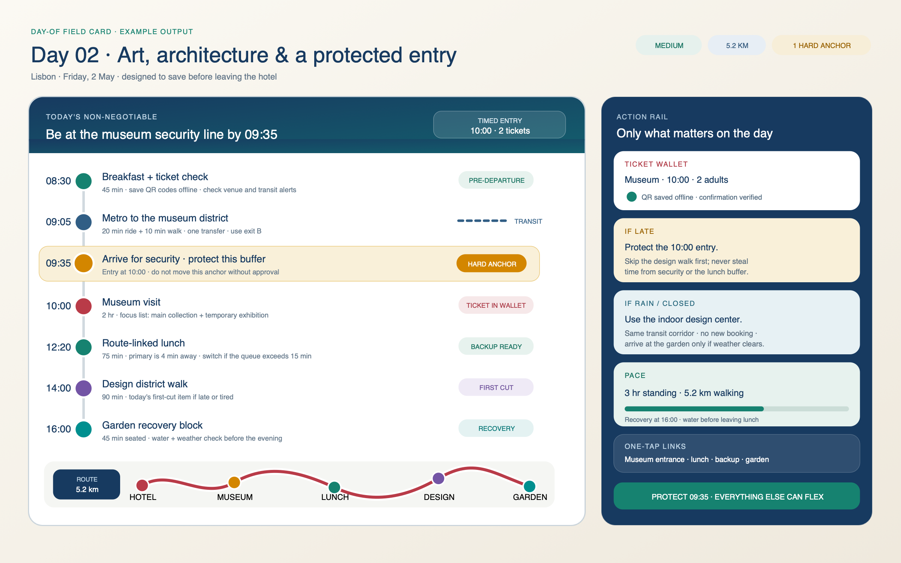
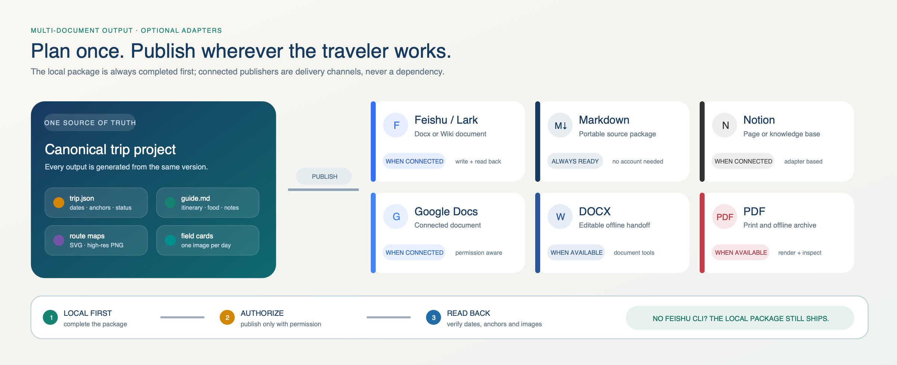
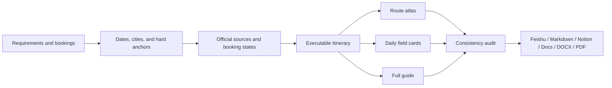

<p align="center">
  <a href="assets/readme-hero.en.svg">
    
  </a>
</p>

<h1 align="center">Plan & Maintain Trips</h1>

<p align="center">
  <a href="./README.md">简体中文</a> · <strong>English</strong>
</p>

<p align="center">
  <strong>Turn a trip from scattered ideas into one project you can book, execute, revise, and audit.</strong>
</p>

<p align="center">
  
  
  
  
</p>

> This is not another attraction list. Every schedule, reservation, restaurant, route map, and day-of field card is derived from one canonical trip state. Change one decision, and every affected deliverable stays in sync.

## See what it ships

### 1. One map for the whole trip

Each day gets its own color and numbered stops. Walking, transit, pace, fixed reservations, and the first item to cut are visible without digging through a long document.

<p align="center">
  <a href="assets/readme-route-sample.en.svg">
    
  </a>
</p>

<p align="center"><sub>Click the image for the lossless SVG. The README uses a 2400×1600 PNG for reliable GitHub rendering.</sub></p>

### 2. A field card for every day

The full guide is for planning. On the road, you need one card that answers what happens next. Each card keeps only the essentials: protected reservations, arrival time, sequence, tickets, route, lunch, pace, and what to drop when you are late or the weather changes.

<p align="center">
  <a href="assets/readme-day-card.en.svg">
    
  </a>
</p>

Each field card can:

- ship as a separate high-resolution PNG that is easy to save to a phone;
- retain a lossless SVG source for editing, printing, or embedding in a guide;
- keep a searchable text version for addresses and accessibility;
- expose missing hotel, flight, or ticket details instead of inventing them.

### 3. One plan, multiple publishing targets

Feishu is an optional publisher, not a prerequisite. The Skill completes a platform-independent local delivery package first, then publishes through whichever connected tools the user actually has.

<p align="center">
  <a href="assets/readme-publishing.en.svg">
    
  </a>
</p>

Supported outputs:

- **Always available:** Markdown, `trip.json`, route maps in SVG/PNG, and daily field cards;
- **Feishu / Lark:** publish to Docx or Wiki, insert images, and read back for verification when the capability is installed and authorized;
- **Notion / Google Docs:** publish when the corresponding connector is available and authorized;
- **DOCX / PDF:** create an editable or print-ready archive when document tools are available;
- **No platform connected:** still deliver the complete core guide without blocking on a CLI, account, or connector.

## Capabilities and deliverables

The visuals above show the finished artifacts. This table shows what the Skill does throughout the planning process.

| Stage | What it does | What you receive |
|---|---|---|
| Intake | Consolidates dates, lodging, transport, budget, preferences, exclusions, and immovable plans | Trip overview + canonical `trip.json` state |
| Official research | Verifies hours, closure days, reservation rules, release windows, and official entry points | Booking checklist with status, evidence, next action, and fallback |
| Route scheduling | Balances geography, visit duration, security queues, transfers, recovery, and physical load | Executable day-by-day schedule with concrete times |
| Restaurant fit | Selects food around the actual route, booking gaps, opening hours, and queue risk | Primary and backup restaurants with route-specific reasoning |
| Maps and field execution | Encodes days with colors and numbered stops, then extracts the decisions that matter on site | High-resolution route atlas + daily field cards |
| Controlled revisions | Traces each date, hotel, or attraction change into bookings, routes, restaurants, and maps | Change log + synchronized deliverables |
| Final delivery | Audits dates, nights, hard anchors, links, budget, and cross-format consistency before publishing | Markdown / Feishu / Notion / Google Docs / DOCX / PDF |

## Why it does not drift out of sync

🧭 **One source of truth** — dates, lodging, transport, reservations, and exclusions live in one canonical state.

🎫 **Precise booking states** — clearly distinguishes not released, date not in the system, sold out, walk-in, and booked.

📍 **Routing beyond distance** — accounts for opening times, security, queues, slopes, luggage, meals, recovery, and the next fixed reservation.

🔁 **Impact analysis for every revision** — checks affected dates, tickets, hotels, transport, restaurants, maps, budgets, and field cards.

🌧️ **Day-of decisions built in** — states what must be protected, what to cut first, and what to do during rain or closures.

## How it works



## Start in 30 seconds

Install the Skill in your Codex skills directory, then start a new task or reload skills:

```text
Use $plan-and-maintain-trips to plan a trip to Japan from October 1 to October 10.
We arrive in Tokyo, depart from Osaka, travel as two people, and prefer a moderate pace.
Give us a booking checklist, detailed routes, route-linked restaurants, daily field cards,
and a final guide.
```

It also maintains an existing plan through changes:

```text
Use $plan-and-maintain-trips to update the current itinerary. Keep the Kyoto hotel unchanged,
and do not move the booked Shinkansen. Move Nara one day later, then synchronize the restaurants,
booking checklist, route atlas, and daily field cards.
```

Install on another machine that is already signed in to GitHub:

```bash
gh repo clone judefluen-coder/plan-and-maintain-trips \
  ~/.codex/skills/plan-and-maintain-trips
```

<details>
<summary><strong>Booking status dictionary</strong></summary>

- `bookable`: the target date is available to book now.
- `not_released`: the official operator has confirmed that sales have not opened yet.
- `date_not_in_system`: the target date is not visible and there is not enough evidence to infer the release rule.
- `sold_out`: the official source explicitly shows the target date or performance as sold out.
- `walk_in`: normal entry without advance booking.
- `same_day`: booking is only available or most appropriate on the day.
- `booked`: the user has a confirmation number, ticket, or QR code.
- `needs_recheck`: the conclusion is temporary and has a defined recheck time.

`unknown` may exist briefly during research, but must be resolved before final delivery.

</details>

<details>
<summary><strong>Built-in validation and mapping tools</strong></summary>

The scripts use only the Python standard library:

```bash
# Check dates, hotel nights, hard anchors, booking evidence, and unresolved placeholders
python3 scripts/validate_trip.py trip.json --strict

# Render a lossless 2480×3508 SVG route map from latitude and longitude data
python3 scripts/render_route_map.py route.json route-map.svg

# Check booking and reservation links in a guide
python3 scripts/check_links.py guide.md
```

Example of a successful state validation:

```text
PASS: 5 days, 2 segments, 2 anchors, 2 bookings; 0 errors, 0 warnings
```

</details>

<details>
<summary><strong>Repository structure</strong></summary>

```text
plan-and-maintain-trips/
├── README.md / README.en.md
├── SKILL.md
├── agents/openai.yaml
├── assets/
│   ├── trip.example.json
│   ├── route.example.json
│   ├── guide-template.md
│   ├── readme-*.{png,svg}       # Chinese visuals
│   └── readme-*.en.{png,svg}    # English visuals
├── references/
│   ├── state-model.md
│   ├── research-and-evidence.md
│   ├── scheduling-and-change-control.md
│   ├── deliverables-and-publishing.md
│   └── quality-gates.md
└── scripts/
    ├── validate_trip.py
    ├── render_route_map.py
    └── check_links.py
```

</details>

## Guardrails

- Never purchase, book, send messages, install software, or publish documents without authorization.
- Never label an unavailable future date as sold out without evidence, or silently move a user-defined hard anchor.
- Never compare an aggregator teaser price with a tax-inclusive price under different room or cancellation terms.
- Treat route maps as planning tools; check live navigation, weather, and operator notices on the day.
- Never store passports, payment details, account credentials, tokens, or authorization codes in the project or Skill.

---

<p align="center">
  <strong>Plan beautifully. Book deliberately. Travel calmly.</strong><br>
  <sub>漂亮地规划，克制地预约，从容地出发。</sub>
</p>
