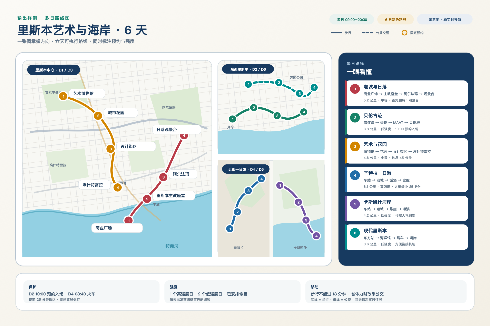
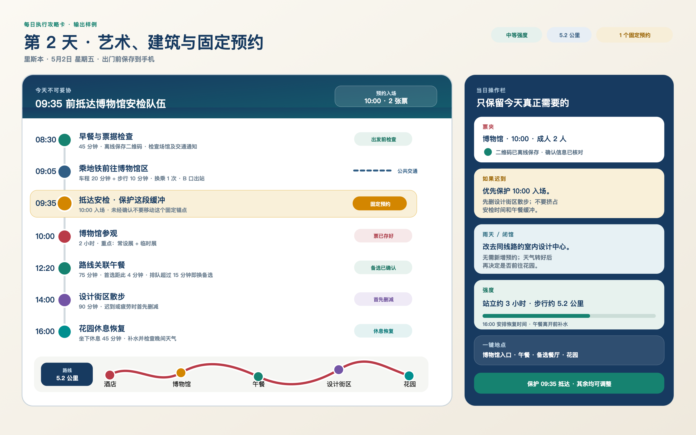
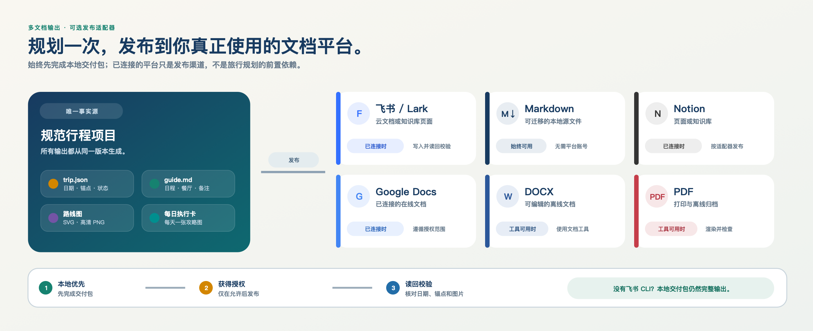
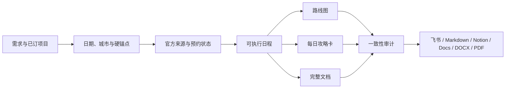

<p align="center">
  <a href="assets/readme-hero.svg">
    
  </a>
</p>

<h1 align="center">Plan & Maintain Trips</h1>

<p align="center">
  <strong>简体中文</strong> · <a href="./README.en.md">English</a>
</p>

<p align="center">
  <strong>把一次旅行，从零散想法变成可以预约、执行、调整和复查的完整项目。</strong>
</p>

<p align="center">
  
  
  
  
</p>

> 不是再生成一份“景点清单”。所有日程、预约、餐厅、路线图和当天执行卡，都由同一份行程状态派生；改动一个决定，其余产物会跟着同步。

## 先看它能交付什么

### 1. 一张看懂多天路线

每天一种颜色，站点按顺序编号；步行、公共交通、强度、固定预约和 first cut 都在图上，不需要再对着长篇文字找重点。

<p align="center">
  <a href="assets/readme-route-sample.svg">
    
  </a>
</p>

<p align="center"><sub>点击图片查看无损 SVG；README 使用 2400×1600 PNG，保证 GitHub 稳定显示。</sub></p>

### 2. 每天一张真正能带走的攻略图

长攻略适合出发前研究，旅行当天更需要一眼就能执行的卡片。每张卡只保留当日必要信息：必须保护的预约、抵达时间、顺序、票夹、路线、午餐、强度，以及迟到或下雨时怎么删。

<p align="center">
  <a href="assets/readme-day-card.svg">
    
  </a>
</p>

这样的执行卡可以：

- 每天单独输出为高清 PNG，直接保存到手机相册；
- 保留 SVG 无损源文件，适合修改、打印或插入攻略文档；
- 同时保留文字版，便于搜索、复制地址和使用无障碍工具；
- 在酒店、航班或票号尚未确认时留下显眼的待补字段，不编造信息。

### 3. 一份计划，多种文档出口

飞书不是前置条件，而是可选发布端。Skill 会先把本地交付包做完整，再根据当前已连接的工具输出到用户真正使用的平台。

<p align="center">
  <a href="assets/readme-publishing.svg">
    
  </a>
</p>

支持的输出方式：

- **始终可用：** Markdown、`trip.json`、路线图 SVG/PNG、每日执行卡；
- **飞书 / Lark：** 已安装并授权相应能力时，可写入 Docx 或 Wiki，插入图片并在发布后读回校验；
- **Notion / Google Docs：** 相应连接器可用并获得授权时发布；
- **DOCX / PDF：** 文档工具可用时生成可编辑版或打印归档版；
- **平台不可用时：** 核心攻略仍然完整交付，不会因为没有 CLI、账号或连接器而停住。

## 完整能力与交付一览

上面的图片展示了最终成品；这张表说明它在旅行规划过程中具体会做什么。

| 规划环节 | 它会做什么 | 你会拿到什么 |
|---|---|---|
| 信息收口 | 整理日期、住宿、交通、预算、偏好、排除项与不可移动安排 | 行程总览 + 唯一事实源 `trip.json` |
| 官方查证 | 核对开放时间、闭馆日、预约规则、开票窗口与官方入口 | 带状态、证据、下一步和备选方案的订票 Checklist |
| 路线排程 | 综合地理位置、游玩时长、安检排队、移动时间、休息与体力 | 可执行到具体时间的每日详细路线 |
| 餐厅衔接 | 按当天路线、预约间隙、营业时间和排队风险选择餐厅 | 主选与备选餐厅 + 为什么适合当天的说明 |
| 地图与现场执行 | 用不同颜色和编号表达多日路线，并提炼当天必须保护的事项 | 高清路线图 + 每日执行攻略卡 |
| 持续调整 | 每次改日期、酒店或景点时，检查受影响的预约、路线、餐厅与地图 | 变更记录 + 同步更新后的全套产物 |
| 最终交付 | 审计日期、晚数、硬锚点、链接、预算和版本一致性，再按需发布 | Markdown / 飞书 / Notion / Google Docs / DOCX / PDF |

## 它为什么不容易“越改越乱”

🧭 **一个事实源**　日期、住宿、交通、预约和排除项都保存在同一份规范状态里。

🎫 **预约状态不含糊**　明确区分“尚未开票”“日期未上线”“已售罄”“现场进入”和“已经订好”。

📍 **路线不只看距离**　同时考虑开门时间、安检、排队、坡度、行李、吃饭、休息和下一场预约。

🔁 **每次修改都有影响分析**　同步检查相关日期、门票、酒店、交通、餐厅、地图、预算和每日卡片。

🌧️ **每天都有现场决策**　明确写出必须保护什么、迟到先删什么、下雨或闭馆去哪里。

## 工作方式



## 30 秒开始使用

安装到 Codex Skill 目录后，新建任务或重新加载 Skill：

```text
使用 $plan-and-maintain-trips，帮我规划 10 月 1 日到 10 月 10 日的日本旅行。
东京入境、大阪离境，两个人，强度适中。
请给我订票 Checklist、详细路线、路线关联餐厅、每日攻略图和最终文档。
```

它也适合持续修改已有计划：

```text
使用 $plan-and-maintain-trips 更新现有行程：京都酒店不变，已订的新干线不能移动；
把奈良往后挪一天，并同步修改餐厅、预约 Checklist、路线图和每日执行卡。
```

在另一台已登录 GitHub 的机器安装：

```bash
gh repo clone judefluen-coder/plan-and-maintain-trips \
  ~/.codex/skills/plan-and-maintain-trips
```

<details>
<summary><strong>预约状态词典</strong></summary>

- `bookable`：目标日期现在可以预订。
- `not_released`：官方明确尚未开始销售。
- `date_not_in_system`：日期尚未进入系统，暂无充分证据判断开售规则。
- `sold_out`：官方明确显示目标日期或场次售罄。
- `walk_in`：正常现场进入，无需提前预约。
- `same_day`：只能或适合当天预约。
- `booked`：用户已有确认号、票据或二维码。
- `needs_recheck`：当前结论临时有效，已经设置复查时间。

`unknown` 只允许在研究过程中短暂存在，最终交付前必须消除。

</details>

<details>
<summary><strong>内置校验与路线图工具</strong></summary>

这些脚本只使用 Python 标准库：

```bash
# 检查日期、住宿晚数、硬锚点、预约证据和未解决占位符
python3 scripts/validate_trip.py trip.json --strict

# 从经纬度数据生成 2480×3508 的无损 SVG 路线图
python3 scripts/render_route_map.py route.json route-map.svg

# 检查攻略里的购票与预约链接
python3 scripts/check_links.py guide.md
```

成功的状态校验示例：

```text
PASS: 5 days, 2 segments, 2 anchors, 2 bookings; 0 errors, 0 warnings
```

</details>

<details>
<summary><strong>仓库结构</strong></summary>

```text
plan-and-maintain-trips/
├── README.md / README.en.md
├── SKILL.md
├── agents/openai.yaml
├── assets/
│   ├── trip.example.json
│   ├── route.example.json
│   ├── guide-template.md
│   ├── readme-*.{png,svg}       # 中文视觉稿
│   └── readme-*.en.{png,svg}    # English visuals
├── references/
│   ├── state-model.md
│   ├── research-and-evidence.md
│   ├── scheduling-and-change-control.md
│   ├── deliverables-and-publishing.md
│   └── quality-gates.md
└── scripts/
    ├── validate_trip.py
    ├── render_route_map.py
    └── check_links.py
```

</details>

## 设计边界

- 不会未经授权替用户购买、预约、发消息、安装软件或发布文档。
- 不会把未出现目标日期直接写成售罄，也不会静默移动用户指定的硬锚点。
- 不会把聚合平台的诱导价与含税、同房型、同退改条件的最终价格混为一谈。
- 路线图用于规划；出发当天仍应检查实时导航、天气和运营方通知。
- 不在项目或 Skill 中保存护照、支付信息、账号凭证、Token 或授权码。

---

<p align="center">
  <strong>漂亮地规划，克制地预约，从容地出发。</strong><br>
  <sub>Plan beautifully. Book deliberately. Travel calmly.</sub>
</p>
