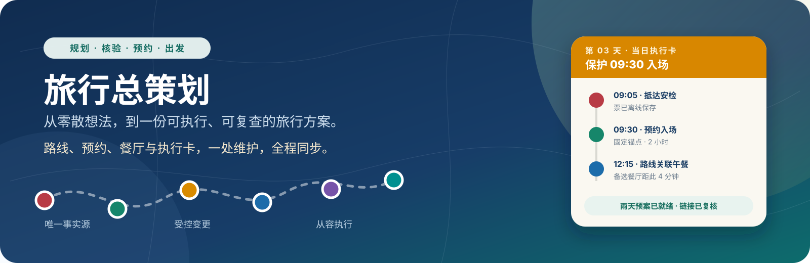
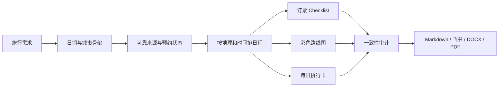
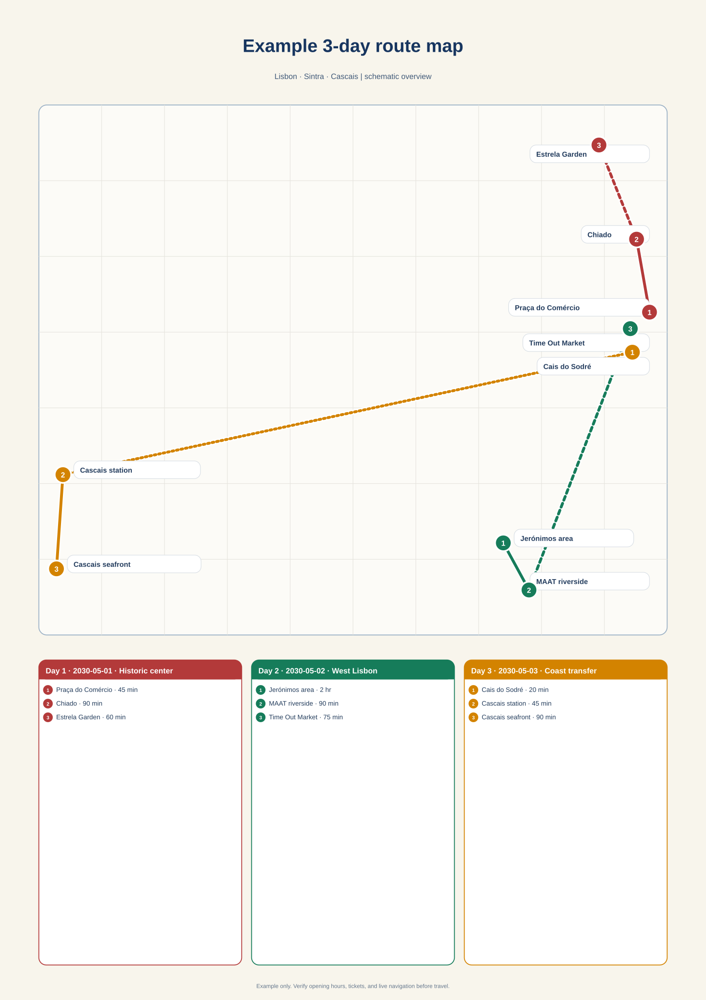

<p align="center">
  
</p>

<h1 align="center">Plan & Maintain Trips</h1>

<p align="center">
  <strong>不是再生成一份“景点清单”，而是把整趟旅行维护成一个可以预约、执行、调整和复查的项目。</strong>
</p>

<p align="center">
  
  
  
  
</p>

---

## 旅行规划真正难的，不是“去哪儿”

真正困难的是：博物馆日期还没放票还是已经售罄？酒店换了以后哪些路线要重排？一场演出固定之后，晚餐、交通和第二天强度是否仍然合理？飞书不可用时，最终攻略还能不能交付？

`plan-and-maintain-trips` 把这些问题放进同一个受控工作流：

| 常见失控点 | 这个 Skill 的处理方式 |
|---|---|
| 日期、酒店、预约散落在聊天里 | 建立唯一的 `trip.json` 作为事实源 |
| “预约不了”被直接理解为“卖光了” | 使用受控状态，区分未开票、日期未上线与售罄 |
| 行程只看地图距离，不看开门时间和排队 | 同时检查地理、营业时间、安检、缓冲与体力 |
| 改动一个日期后，地图和攻略互相矛盾 | 做变更影响分析，并同步更新所有相关产物 |
| 每天排得很满，却没有迟到或下雨预案 | 每天都提供 first cut 和 disruption branch |
| 只有长攻略，旅行当天翻不到重点 | 额外生成适合手机查看的 Day-of Field Card |
| 没有飞书 CLI 或指定发布平台 | 先完成平台无关文件，再把发布器作为可选适配器 |

## 一条从想法到出发的完整链路



核心原则只有一句：**所有攻略、地图、Checklist 和执行卡都从同一份行程状态派生。**

## 它会交付什么

| 产物 | 你会看到的内容 |
|---|---|
| 行程总览 | 入离境、住宿基地、晚数、城市间移动与不可移动事项 |
| 预约控制台 | 优先级、状态、目标日期、官方入口、开票逻辑、下一步和备选方案 |
| 每日详细路线 | 具体时间、游玩时长、移动方式、午晚餐、休息、迟到与雨天分支 |
| 路线关联餐厅 | 不只推荐“好吃的”，而是说明它为什么适合当天位置与预约时间 |
| 高清路线图 | 每日不同颜色、编号站点、步行实线、公共交通虚线和短日程卡 |
| 当日执行手册 | 今日必须保护的预约、时间线、票夹、位置链接和现场决策规则 |
| 变更记录 | 用户决定、原因、受影响日期与已同步的产物 |
| 最终审计 | 日期、晚数、硬约束、链接、地图、预算和各版本的一致性检查 |

## 输出范例

下面使用虚构的葡萄牙双基地文化旅行演示输出形态；它不包含任何真实用户数据。

### 1. 高清多日路线图

<p align="center">
  
</p>

路线图保留 SVG 无损源文件，默认画布为 `2480 × 3508`。适合继续导出高清 PNG、插入文档或打印。地图是行程结构示意，不冒充逐向导航。

### 2. 预约控制台

| 优先级 | 项目 | 当前状态 | 目标时间 | 为什么是这个状态 | 下一步 |
|---|---|---|---|---|---|
| P0 | 预约制美术馆 | `bookable` | 5 月 2 日 10:00 | 官方页面已出现目标日期库存 | 核对退改规则后购买 2 张 |
| P1 | 海岸城际列车 | `not_released` | 5 月 3 日 11:00 | 运营方尚未开放该日期销售 | 在开售日上午重新检查 |
| P2 | 市场午餐 | `walk_in` | 5 月 1 日 12:30 | 无需预约，按当天排队执行 | 保留附近第二选择 |

这里最重要的不是表格，而是 Skill **不会把“页面里没有这个日期”武断写成“票卖光了”**。

### 3. 可执行日程

> **Day 2 · 艺术与建筑主线**<br>
> **必须保护：** 10:00 美术馆预约，建议 09:35 抵达安检入口。

| 时间 | 安排 | 时长 | 移动与缓冲 |
|---|---|---:|---|
| 08:30 | 酒店早餐并确认电子票 | 45 分钟 | 出门前检查临时闭馆通知 |
| 09:15 | 前往美术馆 | 20 分钟 | 另留 25 分钟排队与找入口 |
| 10:00 | 预约制美术馆 | 2 小时 | 硬锚点，不移动 |
| 12:20 | 路线附近午餐 | 75 分钟 | 若排队超过 15 分钟，切换备选餐厅 |
| 14:00 | 建筑街区散步 | 90 分钟 | 当天第一删减项 |
| 16:00 | 花园休息 | 45 分钟 | 为晚餐前恢复体力 |

- **First cut：** 14:00 建筑街区散步。
- **雨天分支：** 换成同线路的室内设计馆，不影响上午预约。
- **强度判断：** 中等；站立约 3 小时，集中步行约 5 公里。

### 4. 当日执行卡

<table>
  <tr>
    <td width="50%" valign="top">
      <strong>今晚先做</strong><br><br>
      ✓ 把美术馆二维码存入离线相册<br>
      ✓ 检查次日营业与交通通知<br>
      ✓ 确认手机地图离线区域
    </td>
    <td width="50%" valign="top">
      <strong>明天现场规则</strong><br><br>
      ⏰ 09:35 前到入口<br>
      ✂️ 迟到 30 分钟先删下午散步<br>
      ☔ 下雨启用室内设计馆分支
    </td>
  </tr>
</table>

> **今天必须保护什么？** 10:00 的预约制美术馆；其余项目都可以围绕它缩短或替换。

完整的示例输入与模板：

- [`assets/trip.example.json`](assets/trip.example.json)：五天、双基地、含硬锚点与证据记录的规范状态。
- [`assets/route.example.json`](assets/route.example.json)：路线图坐标与每日颜色示例。
- [`assets/guide-template.md`](assets/guide-template.md)：最终攻略的完整交付结构。

## 快速开始

### 在 Codex 中调用

将仓库安装到 Codex Skill 目录后，新建任务或重新加载 Skill，即可直接说：

```text
使用 $plan-and-maintain-trips，帮我规划 10 月 1 日到 10 月 10 日的日本旅行。
东京入境、大阪离境，两个人，希望强度适中；请生成订票清单、详细路线、餐厅建议、每日执行卡和路线图。
```

它也适合在已有计划上持续修改：

```text
使用 $plan-and-maintain-trips 更新现有行程：京都酒店不变，已订的新干线不能移动；
把奈良往后挪一天，并同步修改餐厅、预约 Checklist、路线图和当日执行卡。
```

### 在另一台机器安装

```bash
gh repo clone judefluen-coder/plan-and-maintain-trips \
  ~/.codex/skills/plan-and-maintain-trips
```

这是私有仓库，克隆机器需要先登录有权限的 GitHub 账号。

## 预约状态词典

Skill 只使用下面这些状态，避免模糊表达：

| 状态 | 含义 |
|---|---|
| `bookable` | 目标日期现在可以预订 |
| `not_released` | 官方明确尚未开始销售 |
| `date_not_in_system` | 目标日期尚未进入系统，但没有足够证据说明开售规则 |
| `sold_out` | 官方明确显示目标日期或场次售罄 |
| `walk_in` | 正常现场进入，无需提前预约 |
| `same_day` | 只能或适合当天预约 |
| `booked` | 用户已有确认号、票据或二维码 |
| `needs_recheck` | 当前结论临时有效，已设置复查时间 |

`unknown` 只允许在研究过程中短暂存在，最终交付前必须消除。

## 自带的确定性工具

不依赖第三方 Python 包。

```bash
# 严格检查日期、住宿晚数、硬锚点、预约证据和未解决占位符
python3 scripts/validate_trip.py trip.json --strict

# 从经纬度数据生成 2480×3508 的无损 SVG 路线图
python3 scripts/render_route_map.py route.json route-map.svg

# 检查攻略里的购票与预约链接
python3 scripts/check_links.py guide.md
```

成功的状态校验会得到类似结果：

```text
PASS: 5 days, 2 segments, 2 anchors, 2 bookings; 0 errors, 0 warnings
```

## 发布平台不是前置条件

Skill 会先生成平台无关的本地交付包，再按可用能力发布到飞书/Lark、Notion、Google Docs、DOCX 或 PDF。没有 CLI、没有账号或尚未授权，都不会阻塞核心攻略的完成。

任何外部写入都需要用户授权；发布后还必须读回关键内容，确认日期、图片和固定预约没有在传输中丢失。

## 文件结构

```text
plan-and-maintain-trips/
├── SKILL.md                         # Codex 执行入口
├── agents/openai.yaml               # Skill 列表与默认提示词
├── assets/
│   ├── trip.example.json            # 规范状态示例
│   ├── route.example.json           # 路线图数据示例
│   ├── route.example.svg            # 真实渲染结果
│   └── guide-template.md             # 最终攻略模板
├── references/
│   ├── state-model.md               # 唯一事实源的数据模型
│   ├── research-and-evidence.md     # 来源与时效性规则
│   ├── scheduling-and-change-control.md
│   ├── deliverables-and-publishing.md
│   └── quality-gates.md             # 最终审计门槛
└── scripts/
    ├── validate_trip.py
    ├── render_route_map.py
    └── check_links.py
```

## 设计边界

- 不会未经授权替用户购买、预约、发消息、安装软件或发布文档。
- 不会把聚合平台价格与含税、同房型、同退改条件的最终价格混为一谈。
- 不会静默移动用户指定的硬锚点，也不会把已经排除的项目偷偷加回来。
- 路线图是规划级示意；出发当天仍应使用实时导航和运营方通知。
- 所有易变化的信息都应保存“查询时间”和“下次复查时间”。
- 不在项目或 Skill 中保存护照、支付信息、账号凭证、Token 或授权码。

---

<p align="center">
  <strong>Plan beautifully. Book deliberately. Travel calmly.</strong><br>
  <sub>漂亮地规划，克制地预约，从容地出发。</sub>
</p>
